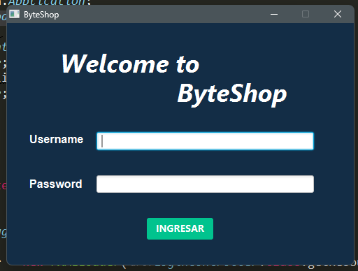
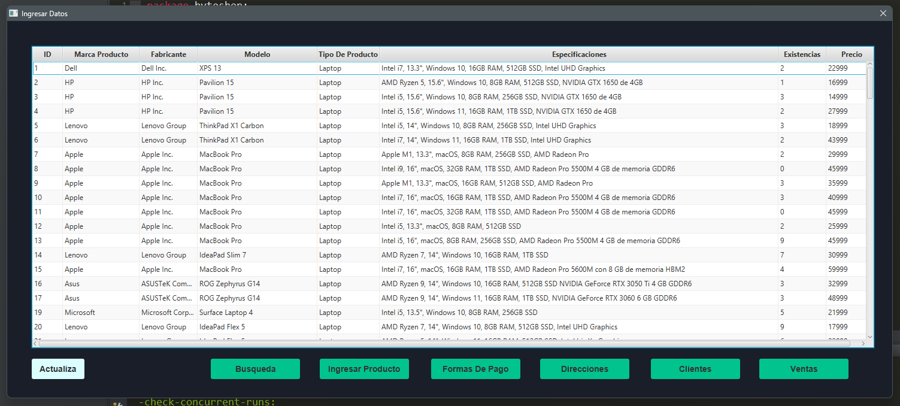
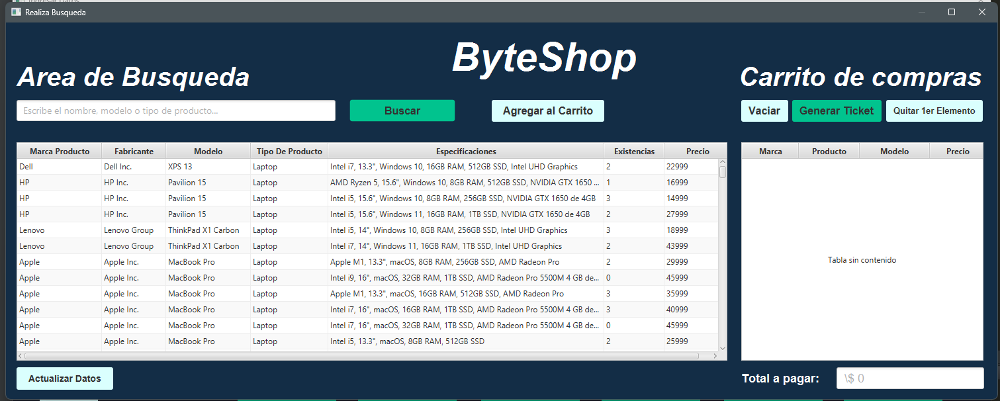
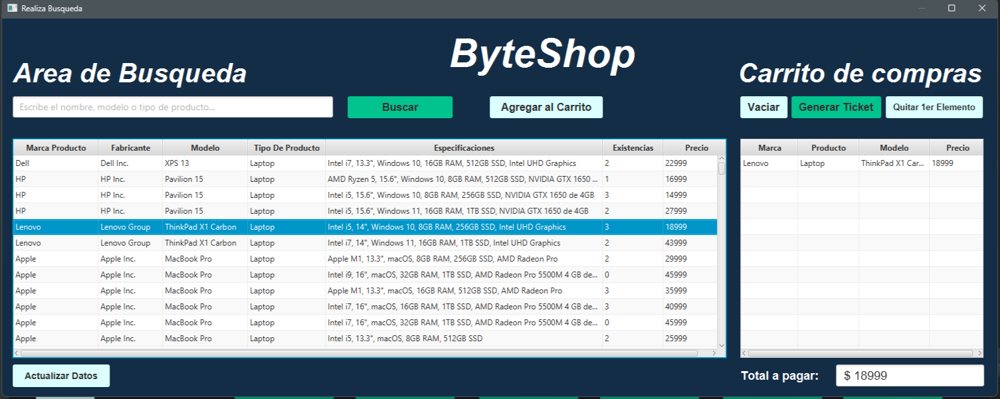
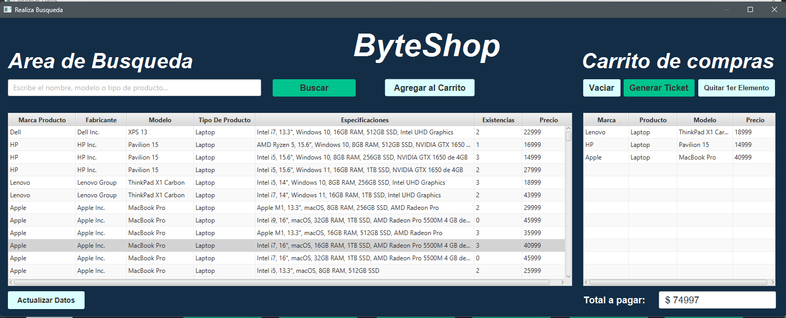
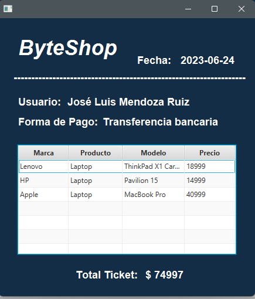
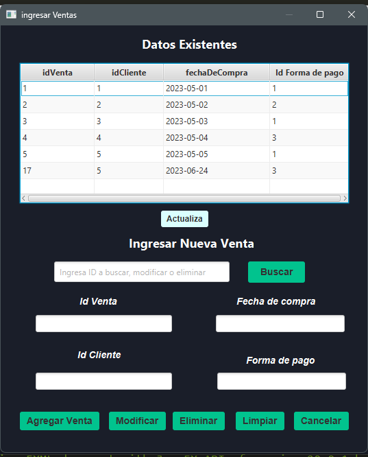
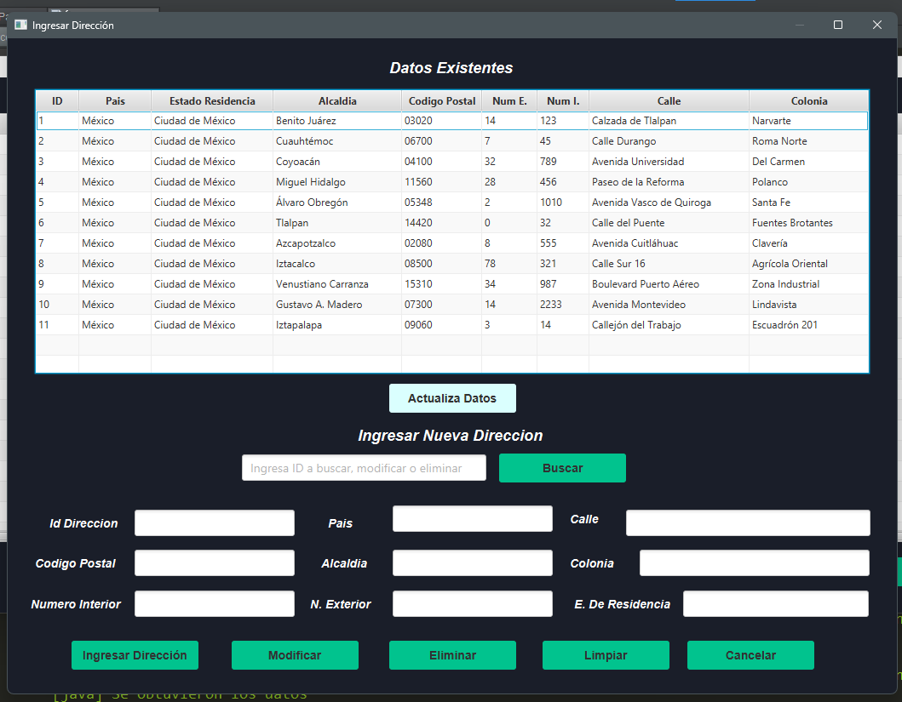
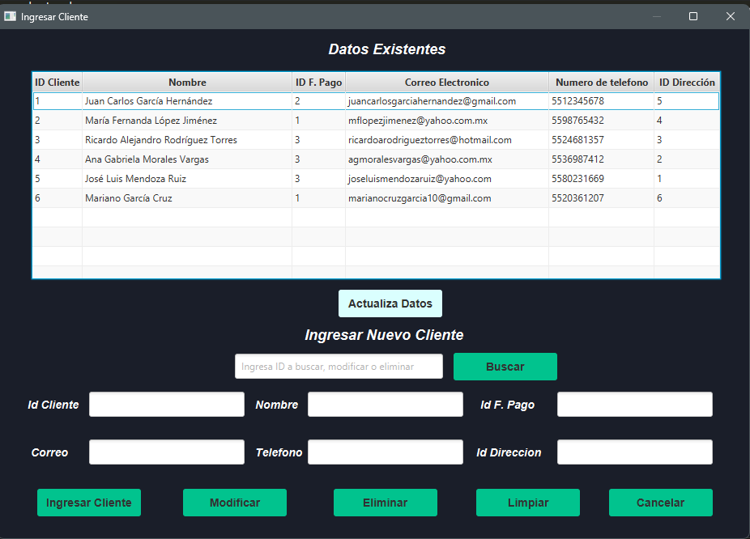
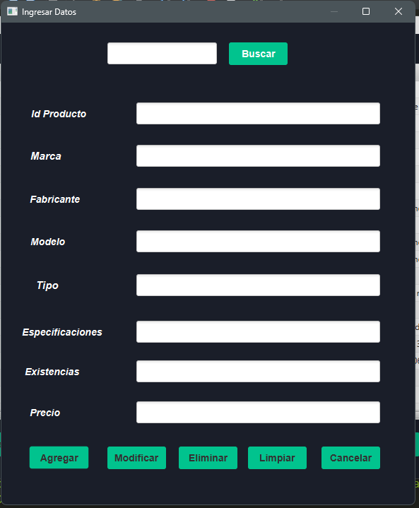

## Un sistema gestión de ventas de computadoras.
* Realizado con Java implementando JavaFx y con el gestos de base de datos MYSQl.
---

---

---

---

---

---

---

---

---

---

---

---